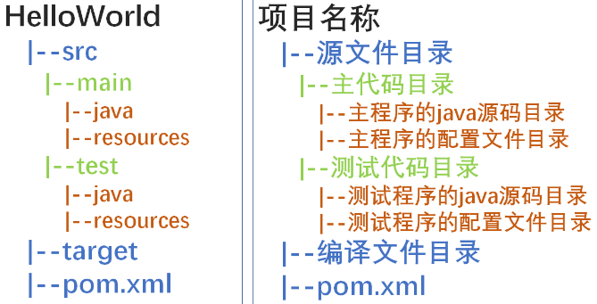
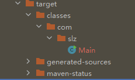

# MavenLearning

# 一、Maven 简介

- 项目管理工具
- 项目对象模型 project object model(POM)

> 一个项目：清理、编译、测试、打包、发布、部署

## 1. Java 构建工具发展

1. make：编写 makefile 进行构建；
2. Ant：aphace, 没有依赖管理；
3. maven：项目依赖管理和构建自动化的工具；遵循"约定大于配置"的规则；（主流使用）
4. gradle：多用于安卓开发，新趋势；
5. bazel：谷歌

## 2. Maven 能做什么？

- 管理 jar 包；
- 构建项目：如果有一个工具，能够从项目清理、编译、测试、打包、安装、部署一整套流程自动完成；
- 项目的拆分与聚合；

## 3. 为什么使用 Maven？

- 组装机和品牌机的概念；
- IDE(集成开发环境)不是万能的；
- 依赖大量的手工操作，编译、测试、代码生成，这些工作是相互独立的，很难完成一键自动操作；
- 很难统一所有IDE的配置；

## 4. Maven 对 Jar 文件的管理

- Jar 包的下载；
- 版本匹配；
- Jar 包的重复应用；
- Jar包之间的依赖关系；

# 二、Maven 应用

## 1. 下载与安装

### （1）下载

官网: https://maven.apache.org

下载: https://dlcdn.apache.org/maven/maven-3/3.8.5/binaries/apache-maven-3.8.5-bin.zip

解压后目录：


> - bin: 存放maven指令
> - boot: 存放类加载器框架
> - conf: 存放配置文件
> - lib: 存放第三方jar包

### （2）安装

> zip包解压后是不需要安装的，但是需要配置环境变量（Maven 安装 / 解压 / 存放路径）

1. 配置 JAVA_HOME 和 MAVEN_HOME （安装目录）


2. 配置 Path （安装目录下的 bin 目录）


3. 判断是否安装成功


## 2. Maven 的项目结构

> 不同的集成开发环境，目录结构是不同的，导致不能直接将不同 IDE 开发的项目进行导入。

maven 项目的目录结构是统一的，符合 maven 项目目录结构的才可以被 maven 管理；

### （1）创建目录




### （2）配置 pom 文件

```xml
<?xml version="1.0" encoding="UTF-8"?>
<project xmlns="http://maven.apache.org/POM/4.0.0"
         xmlns:xsi="http://www.w3.org/2001/XMLSchema-instance"
         xsi:schemaLocation="http://maven.apache.org/POM/4.0.0 http://maven.apache.org/xsd/maven-4.0.0.xsd">
    <modelVersion>4.0.0</modelVersion>

    <!--  仓库坐标  -->
    <groupId>com.slz</groupId> <!--  公司或组织名  -->
    <artifactId>mvn_app</artifactId> <!--  项目名字  -->
    <version>1.0</version> <!--  版本号  -->
</project>
```

### （3）编译

在 pom.xml 文件目录下，即项目路径下，键入命令 `mvn compile`


执行成功后，会生成一个 target 目录，下面有 classes，存放编译之后的.class文件



> 构建/运行报错：`java: 错误: 不支持发行版本 5`，解决办法
>
> 
>
> 
>
> 更改项目配置
>
> 1. 打开项目设置:
>    在 IntelliJ IDEA 中，选择 File -> Project Structure。
> 2. 检查 JDK 版本:
>    在 Project Structure 对话框中，查看 JDK 环境是否设置为 JDK 13 或更高版本。
> 3. 修改 JDK 版本:
>    如果 JDK 版本不是最新的，将其修改为当前系统上安装的最新版本。
> 4. 检查模块配置:
>    转到 Modules 标签页，确保使用的 JDK 版本与上面设置的一致。
> 5. 调整编译器设置:
>    选择 Settings -> Build, Execution, Deployment -> Compiler -> Java Compiler。
>    在这里，确保 Project bytecode version 和 Language level 设置为与你的 JDK 版本相匹配的值。
> 6. 保存并应用更改:
>    点击 Apply 和 OK 保存更改。

## 3. Maven 相关概念

### （1）仓库

> 用于存放 jar 文件以及各种资源的

全球中央仓库: https://repo1.maven.org/maven2/ 或者 https://repo.maven.apache.org/maven2/


> 仓库分成本地仓库和远程仓库
>
> - 本地仓库: 电脑上的文件夹;’
>   - 默认位置：`C:\Users\SunLZ\.m2\repository`，即系统用户目录下的 .m2 目录下的 repository 目录；
> - 远程仓库:
>   - 私服: 公司内部或部门用的仓库; 👀️ (开发的功能，只在公司内部使用) 👀️ (版权问题，如 Oracle 数据库驱动)；
>   - 全球中央仓库: 存储所有 jar 文件资源的;

一般，先从本地仓库寻找 JAR 包，然后是私服（如果有的话），然后是 全球中央仓库，找到之后保存本地；

#### a. 配置本地仓库位置

> 配置文件地址：`D:\Maven\conf\settings.xml`，打开后更改以下部分，保存即可

```xml
<!-- localRepository
   | The path to the local repository maven will use to store artifacts.
   |
   | Default: ${user.home}/.m2/repository
  <localRepository>/path/to/local/repo</localRepository>
  -->
```

#### b. 配置远程仓库镜像 （下载地址）


+++++++++++++++++++++
