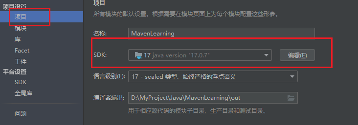
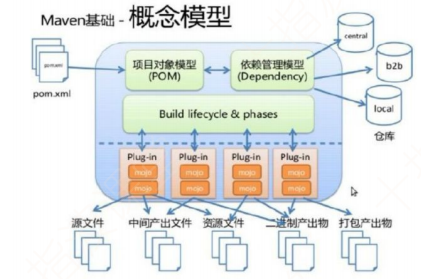
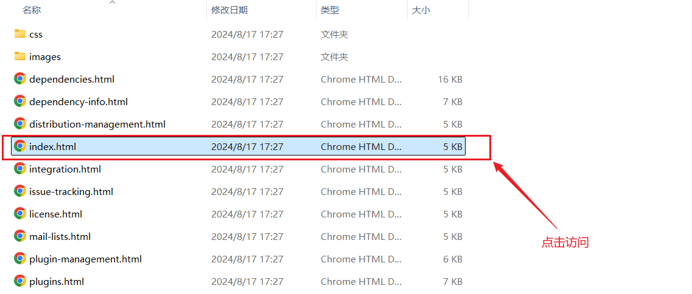
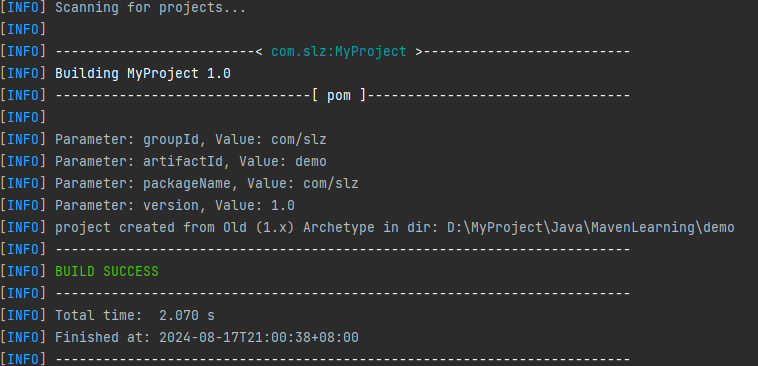
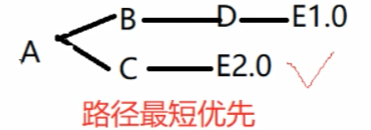
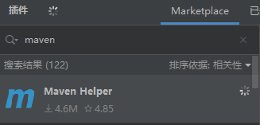
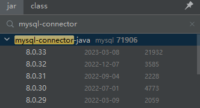
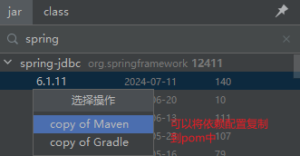
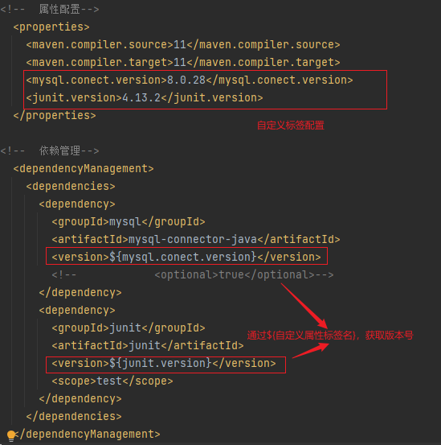
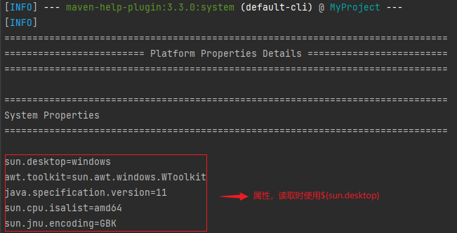

# MavenLearning

# 一、Maven 简介

- 项目管理工具
- 项目对象模型 project object model(POM)

> 一个项目：清理、编译、测试、打包、发布、部署

## 1. Java 构建工具发展

1. make：编写 makefile 进行构建；
2. Ant：aphace, 没有依赖管理；
3. maven：项目依赖管理和构建自动化的工具；遵循"约定大于配置"的规则；（主流使用）
4. gradle：多用于安卓开发，新趋势；
5. bazel：谷歌

## 2. Maven 能做什么？

- 管理 jar 包；
- 构建项目：如果有一个工具，能够从项目清理、编译、测试、打包、安装、部署一整套流程自动完成；
- 项目的拆分与聚合；

## 3. 为什么使用 Maven？

- 组装机和品牌机的概念；
- IDE(集成开发环境)不是万能的；
- 依赖大量的手工操作，编译、测试、代码生成，这些工作是相互独立的，很难完成一键自动操作；
- 很难统一所有IDE的配置；

## 4. Maven 对 Jar 文件的管理

- Jar 包的下载；
- 版本匹配；
- Jar 包的重复应用；
- Jar包之间的依赖关系；

# 二、Maven 应用

## 1. 下载与安装

### （1）下载

官网: https://maven.apache.org

下载: https://dlcdn.apache.org/maven/maven-3/3.8.5/binaries/apache-maven-3.8.5-bin.zip

解压后目录：


> - bin: 存放maven指令
> - boot: 存放类加载器框架
> - conf: 存放配置文件
> - lib: 存放第三方jar包

### （2）安装

> zip包解压后是不需要安装的，但是需要配置环境变量（Maven 安装 / 解压 / 存放路径）

1. 配置 JAVA_HOME 和 MAVEN_HOME （安装目录）


2. 配置 Path （安装目录下的 bin 目录）


3. 判断是否安装成功


## 2. Maven 的项目结构

> 不同的集成开发环境，目录结构是不同的，导致不能直接将不同 IDE 开发的项目进行导入。

maven 项目的目录结构是统一的，符合 maven 项目目录结构的才可以被 maven 管理；

### （1）创建目录


### （2）配置 pom 文件

```xml
<?xml version="1.0" encoding="UTF-8"?>
<project xmlns="http://maven.apache.org/POM/4.0.0"
         xmlns:xsi="http://www.w3.org/2001/XMLSchema-instance"
         xsi:schemaLocation="http://maven.apache.org/POM/4.0.0 http://maven.apache.org/xsd/maven-4.0.0.xsd">
    <modelVersion>4.0.0</modelVersion>

    <!--  Maven 坐标  -->
    <groupId>com.slz</groupId> <!--  公司或组织名  -->
    <artifactId>mvn_app</artifactId> <!--  项目名字  -->
    <version>1.0</version> <!--  版本号  -->
</project>
```

### （3）编译

在 pom.xml 文件目录下，即项目路径下，键入命令 `mvn compile`


执行成功后，会生成一个 target 目录，下面有 classes，存放编译之后的.class文件


> 构建/运行报错：`java: 错误: 不支持发行版本 5`，解决办法
>
> 
>
> 
>
> 更改项目配置
>
> 1. 打开项目设置:
>    在 IntelliJ IDEA 中，选择 File -> Project Structure。
> 2. 检查 JDK 版本:
>    在 Project Structure 对话框中，查看 JDK 环境是否设置为 JDK 13 或更高版本。
> 3. 修改 JDK 版本:
>    如果 JDK 版本不是最新的，将其修改为当前系统上安装的最新版本。
> 4. 检查模块配置:
>    转到 Modules 标签页，确保使用的 JDK 版本与上面设置的一致。
> 5. 调整编译器设置:
>    选择 Settings -> Build, Execution, Deployment -> Compiler -> Java Compiler。
>    在这里，确保 Project bytecode version 和 Language level 设置为与你的 JDK 版本相匹配的值。
> 6. 保存并应用更改:
>    点击 Apply 和 OK 保存更改。

## 3. Maven 相关概念

### （1）仓库

> 用于存放 jar 文件以及各种资源的

全球中央仓库: https://repo1.maven.org/maven2/ 或者 https://repo.maven.apache.org/maven2/


> 仓库分成本地仓库和远程仓库
>
> - 本地仓库: 电脑上的文件夹;’
>   - 默认位置：`C:\Users\SunLZ\.m2\repository`，即系统用户目录下的 .m2 目录下的 repository 目录；
> - 远程仓库:
>   - 私服: 公司内部或部门用的仓库; 👀️ (开发的功能，只在公司内部使用) 👀️ (版权问题，如 Oracle 数据库驱动)；
>   - 全球中央仓库: 存储所有 jar 文件资源的;

一般，先从本地仓库寻找 JAR 包，然后是私服（如果有的话），然后是 全球中央仓库，找到之后保存本地；

#### a. 配置本地仓库位置

> 配置文件地址：`D:\Maven\conf\settings.xml`，打开后更改以下部分，保存即可

```xml
<!-- localRepository
   | The path to the local repository maven will use to store artifacts.
   |
   | Default: ${user.home}/.m2/repository
  <localRepository>/path/to/local/repo</localRepository>
  -->
```

#### b. 配置远程仓库镜像 （下载地址）

> 配置文件地址：`D:\Maven\conf\settings.xml`，打开后更改以下部分，保存即可
>
> https://developer.aliyun.com/mvn/guide

```xml
<mirrors>
    <!-- mirror
     | Specifies a repository mirror site to use instead of a given repository. The repository that
     | this mirror serves has an ID that matches the mirrorOf element of this mirror. IDs are used
     | for inheritance and direct lookup purposes, and must be unique across the set of mirrors.
     |
    <mirror>
      <id>mirrorId</id>
      <mirrorOf>repositoryId</mirrorOf>
      <name>Human Readable Name for this Mirror.</name>
      <url>http://my.repository.com/repo/path</url>
    </mirror>
     -->
    <mirror>
      <id>aliyunmaven</id>
      <mirrorOf>*</mirrorOf>
      <name>阿里云公共仓库</name>
      <url>https://maven.aliyun.com/repository/public</url>
    </mirror>
  </mirrors>
```

### （2）Maven 仓库坐标

```xml
    <!--  Maven坐标  -->
    <groupId>com.slz</groupId> <!--  公司或组织名  -->
    <artifactId>mvn_app</artifactId> <!--  项目名字  -->
    <version>1.0</version> <!--  版本号  -->
```

> 用于定位仓库中资源的位置，组成：gav
>
> - groupId：组织/公司/团体名称，通常是域名反向写法；（com.slz）
> - artifactId： 项目名称 / 模块名称；(app)
> - version：项目版本号（主版本号.次版本号.小版本号），SHAPSHOT(快照，即开发版本，不稳定)

### （3）Maven 依赖

> https://mvnrepository.com/ maven仓库，查找并导入依赖


在 pom.xml 文件中配置：

```xml
    <!-- 依赖   -->
    <dependencies>
        <!-- https://mvnrepository.com/artifact/junit/junit -->
        <dependency>
            <groupId>junit</groupId>
            <artifactId>junit</artifactId>
            <version>4.13.2</version>
            <scope>test</scope> <!-- 作用范围 -->
        </dependency>
        <!-- https://mvnrepository.com/artifact/mysql/mysql-connector-java -->
        <dependency>
            <groupId>mysql</groupId>
            <artifactId>mysql-connector-java</artifactId>
            <version>8.0.29</version>
        </dependency>
    </dependencies>
```

#### a. 创建测试单元

- 创建一个类，里面有一个方法，执行加法运算：

  ```java
  package com.slz.app;

  public class Add {
      public int add(int a, int b){
          return a+b;
      }
  }
  ```
- 创建测试单元，在 src->test->java 下面创建：

  ```java
  package com.slz.app;

  import org.junit.Test;
  import org.junit.Assert;

  public class TestAdd {
      @Test
      public void testAdd(){
          Add m = new Add();
          int result = m.add(10, 10);
          Assert.assertEquals(20, result);
      }
  }
  ```
- 控制台运行：`mvn clean` 和 `mvn test`，可以完成自动化测试，并生成测试报告；

### （4）Maven 生命周期、指令



#### a. 指令

- `mvn clean`：清理指令，将生成的 target 目录做删除，清除之前编译过的数据；

  - 使用插件: maven-clean-plugin: 2.5；
- `mvn compile`: 编译指令，将 java 源文件做编译，编译成 class 文件，将 class 文件放在 target/classes 下面；

  - 使用插件:
    - maven-resources-plugin: 2.6 资源文件处理插件，将 src/main/resources/ 下面的文件复制到 target/classes 目录下；
    - maven-compiler-plugin: 3.1 执行编译的插件；
- `mvn test-compile`: 编译测试文件的，将 src/test/java 下的文件复制到 target/test-classes 目录下

  - 如果之前没有 compile 源码，会自动执行 compile;
  - 使用插件:
    - maven-resources-plugin: 2.6 资源文件处理插件, 将 src/main/resources/ 下面的文件复制到 target/classes目录下;
    - maven-compiler-plugin: 3.1 执行编译的插件;
- `mvn test`：执行测试，拿到测试结果，生成测试报告；
- `mvn test -Dtest=com.slz.app.\*`：执行多个测试类；

  - 使用插件: maven-surefire-plugin:2.12.4 生成报告，会生成在 target/surefire-reports 目录下；
  - 有两种文件，一种是txt文件，一种是 xml (测试环境和结果)；
- `mvn package`：执行打包操作，jar / war / pom；(打包中不存在测试文件)

  - 使用插件: maven-jar-plugin:2.4:jar, 打包插件，生成jar文件；
  - jar文件名字的生成: target/artifactId-version.jar；

    - 例如：target/mvn_app-1.0.jar；
  - pom.xml 指定打包类型:

    ```xml
    <!--  Maven坐标  -->
        <groupId>com.slz</groupId> <!--  公司或组织名  -->
        <artifactId>mvn_app</artifactId> <!--  项目名字  -->
        <version>1.0</version> <!--  版本号  -->
        <packaging>jar</packaging> <!-- 打包类型 -->
    ```
- `mvn install`：执行安装，将生成的jar文件 存放在本地仓库；❤️

  - 使用插件: maven-install-plugin:2.4 将 jar 文件存放在本地仓库；后续其它项目或者模块依赖此包时，可以通过在 pom.xml 文件中导入坐标；

    ```log
    [INFO] Installing D:\MyProject\Java\MavenLearning\mvn_app\target\mvn_app-1.0.jar to C:\Users\SunLZ\.m2\repository\com\slz\mvn_app\1.0\mvn_app-1.0.jar
    [INFO] Installing D:\MyProject\Java\MavenLearning\mvn_app\pom.xml to C:\Users\SunLZ\.m2\repository\com\slz\mvn_app\1.0\mvn_app-1.0.pom
    ```
- `mvn deploy`：执行部署操作

> 清理 -> 编译 -> 测试 -> 打包 -> 安装 -> 部署 （六大步骤）

#### b. 三套项目构建生命周期

> https://maven.apache.org/ref/3.9.8/maven-core/lifecycles.html


1. clean 清理工作
   1. pre-clean：清理之前完成；
   2. clean：完成清理，移除上次构建的目录或文件；
   3. post-clean：清理之后要完成的工作；
2. default 项目构建的核心工作，如：编译、测试编译、测试、打包、安装等；
3. site：产生报告、发布站点；
   1. pre-site：生成站点之前完成的工作；
   2. site：生成项目站点文档；
   3. post-site：生成站点文档之后要完成的工作；
   4. site-deploy：将生成的站点文档部署在服务器上；

#### c. mvn site ❤️

> - `mvn site` 命令的作用是生成项目的站点文档。站点文档包含了项目的各种报告、文档和其他信息，比如依赖关系图、Javadoc 文档、持续集成构建的状态等。这些信息对于项目的维护者和用户来说都是非常有价值的；
> - 该阶段通常位于 verify 阶段之后，deploy 阶段之前；
> - 除了生成站点文档之外，你还可以使用 `mvn site:deploy` 命令将站点文档部署到服务器上，以便其他人访问；

pom.xml 配置插件

```xml
    <build>
        <plugins>
            <plugin>
                <groupId>org.apache.maven.plugins</groupId>
                <artifactId>maven-project-info-reports-plugin</artifactId>
                <version>3.5.0</version>
            </plugin>
            <plugin>
                <groupId>org.apache.maven.plugins</groupId>
                <artifactId>maven-site-plugin</artifactId>
                <version>3.3</version>
                <configuration>
                    <locales>zh_CN</locales>
                </configuration>
            </plugin>
        </plugins>
    </build>
```

运行指令：`mvn site`


在 target/site 目录下生成站点：




### （5）Maven 插件

> https://maven.apache.org/plugins/index.html 官网查找 maven 插件；如果默认的插件不满足要求，可以到官网寻找并自己配置插件；

pom.xml 配置插件

```xml
            <plugin>
                <groupId>org.apache.maven.plugins</groupId>
                <artifactId>maven-source-plugin</artifactId>
                <version>3.3.1</version>
                <executions>
                    <execution>
                        <id>attach-sources</id>
                        <goals>
                            <goal>jar</goal>
                            <goal>test-jar</goal>
                        </goals>
                        <phase>test-compile</phase> <!-- 在哪个阶段生成-->
                    </execution>
                </executions>
            </plugin>
```

> source 插件，允许将源码.java（未编译为.class文件）打包成 jar 包

# 三、Maven 使用

## 1. 创建 maven 工程

### （1）手动创建

> 如前所述

### （2）使用 ArcheType 创建 maven 工程

> ArcheType 是 Maven 项目模板工具箱

`mvn archetype:generate`

> -DgroupId=组织机构名
>
> -DartifactId=项目名称
>
> -Dversion=版本号
>
> -DarcheTypeArtifactId=原型工具 （例如：`-DarcheTypeArtifactId=maven-archetype-quickstart`）
>
> -DinteractiveMode=false （是否开启交互模式）

例如：`mvn archetype:generate -DgroupId='com.slz' -DartifactId=demo -Dversion='1.0' -DarcheTypeArtifactId=maven-archetype-quickstart -DinteractiveMode=false` (创建 java 项目)

`mvn archetype:generate -DgroupId='com.slz' -DartifactId=demo -Dversion='1.0' -DarcheTypeArtifactId=maven-archetype-webapp -DinteractiveMode=false` (创建 web 项目)

> 需要在父项目中运行，且父项目中有pom文件，且设置打包方式为pom

```xml
<?xml version="1.0" encoding="UTF-8"?>
<project xmlns="http://maven.apache.org/POM/4.0.0"
         xmlns:xsi="http://www.w3.org/2001/XMLSchema-instance"
         xsi:schemaLocation="http://maven.apache.org/POM/4.0.0 http://maven.apache.org/xsd/maven-4.0.0.xsd">
    <modelVersion>4.0.0</modelVersion>
    <groupId>com.slz</groupId> <!--  公司或组织名  -->
    <artifactId>MyProject</artifactId> <!--  项目名字  -->
    <version>1.0</version> <!--  版本号  -->
    <packaging>pom</packaging>
</project>
```

运行结果：



### （3）IDEA 创建 Maven 工程


## 2. Maven 依赖的作用范围和传递性

### （1）依赖的作用范围

```xml
<dependencies>
        <!-- https://mvnrepository.com/artifact/junit/junit -->
        <dependency>
            <groupId>junit</groupId>
            <artifactId>junit</artifactId>
            <version>4.13.2</version>
            <scope>test</scope> <!-- 作用范围 -->
        </dependency>
</dependencies>
```

⭐️ 按作用的阶段，分成三种情况：

- 主程序 (src>main>java)范围内有效；
- 测试程序 (src>test>java) 范围内有效；
- 是否参与打包

⭐️ 通过 scope 元素定义依赖范围：


### （2）依赖的传递性

> 依赖具有传递性

- 直接依赖
- 间接依赖

#### a. 依赖冲突问题解决：❤️

```xml
<dependency>
     <groupId>mysql</groupId>
     <artifactId>mysql-connector-java</artifactId>
     <version>8.0.29</version>
</dependency>
<dependency>
     <groupId>mysql</groupId>
     <artifactId>mysql-connector-java</artifactId>
     <version>8.0.28</version>
</dependency>
```

1. **路径最短优先**：当依赖出现重复资源时，路径最短优先（在这里是A间接依赖E2.0版本）；

   
2. **声明顺序优先**：当依赖资源路径长短相同时，配置顺序在前面的优先；

   
3. **后配置优先**（特殊情况）：在 pom.xml 文件中，同时写依赖了一个资源的两个版本，后配置优先；

#### b. 依赖冲突避免

1. 可选依赖

在 pom.xml 文件中，通过 `<optional>true</optional>`，配置：

```xml
        <dependency>
            <groupId>mysql</groupId>
            <artifactId>mysql-connector-java</artifactId>
            <version>8.0.29</version>
            <optional>true</optional>
        </dependency>
```

2. 排除依赖

（a）maven-helper 插件解决

- 安装 maven-helper 插件：



- 在 pom.xml 文件下，有 Dependency Analyzer ：


（b）手动配置

排除配置 pro1 对于 pro2 项目中的依赖的资源进行排除，不需要指定版本

```xml
    <dependency>
      <groupId>com.slz</groupId>
      <artifactId>demo</artifactId>
      <version>1.0</version>
      <exclusions>
        <exclusion>
          <artifactId>mysql-connector-java</artifactId>
          <groupId>mysql</groupId>
        </exclusion>
      </exclusions>
    </dependency>
```

### （3）依赖和插件的区别 ❤️

> Maven 依赖和插件是 Maven 构建工具中的两个重要概念，它们虽然有些相似，但各自有不同的作用和功能：

1. **依赖（Dependency）**：

   - **定义**：依赖是项目在编译、测试和运行时需要的库或框架。它们提供了项目所需的功能或解决方案，例如使用第三方库来实现某些功能。
   - **用途**：依赖主要用于代码编译和运行时的类路径中。它们会被下载到本地 Maven 仓库，并在项目构建时包含在项目的类路径中。
   - **配置**：在 `pom.xml` 文件中的 `<dependencies>` 标签下配置。例如：
     ```xml
     <dependencies>
         <dependency>
             <groupId>org.springframework</groupId>
             <artifactId>spring-core</artifactId>
             <version>5.3.9</version>
         </dependency>
     </dependencies>
     ```
2. **插件（Plugin）**：

   - **定义**：插件是 Maven 用于执行构建任务的工具。插件可以执行不同的构建过程，例如编译代码、运行测试、打包应用程序等。
   - **用途**：插件用于执行构建过程中的各种操作，比如编译源代码、生成 JAR 文件、执行单元测试等。插件的配置通常包含插件的版本、目标和参数等。
   - **配置**：在 `pom.xml` 文件中的 `<build>` 标签下的 `<plugins>` 标签下配置。例如：
     ```xml
     <build>
         <plugins>
             <plugin>
                 <groupId>org.apache.maven.plugins</groupId>
                 <artifactId>maven-compiler-plugin</artifactId>
                 <version>3.8.1</version>
                 <configuration>
                     <source>1.8</source>
                     <target>1.8</target>
                 </configuration>
             </plugin>
         </plugins>
     </build>
     ```

> 总的来说，依赖是项目运行所需的外部库，而插件是 Maven 用于管理构建过程的工具。 ❤️

## 3. Maven 模块的拆分、聚合和继承

### （1）聚合

pom.xml 文件配置：

```xml
  <packaging>pom</packaging> <!-- 父模块需要声明为pom文件，不需要打为jar包 -->
  
  <modules>
      <module>demo</module> <!-- 导入模块-->
      <module>mvn_app</module>
  </modules>
```

> 这里只是将其它模块导入，形成聚合关系（这时候还不是继承关系（父子模块）），这种聚合的关系，使得 root 模块打包时，自动分析依赖关系和版本冲突，比较方便


### （2）继承

在 pom.xml 文件中作父模块声明，表明继承关系

```xml
<!--    父模块声明-->
    <parent>
        <groupId>com.slz</groupId>
        <artifactId>MyProject</artifactId>
        <version>1.0</version>
    </parent>
```

> 因此，可以将子模块中公共的依赖，或规范提取到父模块中进行配置，便于统一管理，降低耦合性

子模块只需要写 artifactId，不写 groupId 和 version，它们将于父模块保持一致；

```xml
  <artifactId>demo</artifactId>
```

`<dependencyManagement>` 和`<dependencies>`之间的关系如下：❤️

> - 版本管理:
>   - `<dependencyManagement>`中声明的依赖版本可以被子项目或其他模块继承。
>   - 如果子项目中的`<dependencies>`部分引用了一个`<dependencyManagement>`中声明过的依赖，并且没有指定版本号，则会使用`<dependencyManagement>`中定义的版本号。
> - 依赖引入:
>   - `<dependencies> `中声明的依赖会被实际添加到项目的类路径中。
>   - `<dependencyManagement> `中声明的依赖不会自动添加到类路径中，除非在`<dependencies>`中显式声明。

#### a. 依赖管理 ⭐️

- 父pom

```xml
  <dependencyManagement>
    <dependencies>
      <dependency>
        <groupId>mysql</groupId>
        <artifactId>mysql-connector-java</artifactId>
        <version>8.0.28</version>
        <!--            <optional>true</optional>-->
      </dependency>
      <dependency>
        <groupId>junit</groupId>
        <artifactId>junit</artifactId>
        <version>4.13.2</version>
        <scope>test</scope>
      </dependency>
    </dependencies>
  </dependencyManagement>
```

- 子 pom

```xml
  <dependencies>
    <dependency>
      <groupId>mysql</groupId>
      <artifactId>mysql-connector-java</artifactId>
    </dependency>
    <dependency>
      <groupId>junit</groupId>
      <artifactId>junit</artifactId>
      <scope>test</scope>
    </dependency>
  </dependencies>
```

> 父模块依赖管理中的依赖，子模块不需要再写版本号，默认使用父模块的依赖管理中的版本（如果需要则可以指定其它版本） ❤️

#### b. 插件管理 ⭐️

- 父 pom

```xml
  <build>
    <pluginManagement>
      <plugins>
        <plugin>
          <groupId>org.apache.maven.plugins</groupId>
          <artifactId>maven-project-info-reports-plugin</artifactId>
          <version>2.7</version>
        </plugin>
        <plugin>
          <groupId>org.apache.maven.plugins</groupId>
          <artifactId>maven-site-plugin</artifactId>
          <version>3.3</version>
        </plugin>
      </plugins>
    </pluginManagement>
  </build>
```

- 子 pom

```xml
<build>
        <plugins>
            <plugin>
                <groupId>org.apache.maven.plugins</groupId>
                <artifactId>maven-project-info-reports-plugin</artifactId>
            </plugin>
            <plugin>
                <groupId>org.apache.maven.plugins</groupId>
                <artifactId>maven-site-plugin</artifactId>
                <configuration>
                    <locales>zh_CN</locales>
                </configuration>
            </plugin>
        </plugins>
<build>
```

## 4. Maven 属性设置 ❤️

```xml
  <properties>
    <maven.compiler.source>11</maven.compiler.source>
    <maven.compiler.target>11</maven.compiler.target>
  </properties>
```

#### ⭐️ maven 依赖版本搜索插件工具






### （1）自定义属性 ⭐️

pom.xml 文件配置：



### （2）内置属性

- `${basedir}` : 项目根目录;
- `${version}` : 项目版本;

### （3）pom 属性

- `${project.build.sourceDirectory}` : 默认 src/main/java
- `${project.build.testSource.Driectory}` : 默认 src/main/test
- `${project.build.directory}` : 默认 target/
- `${project.outputDirectory}` : 默认 target/classes
- `${project.testOutputDirectory}` : 默认 target/test-classes
- `${project.groupId}`
- `${project.artifactId}`
- `${project.version}`

### （4）setting 属性

> 主要用来读取 conf/setting.xml 文件值的

- `${setting.localRepository}` : 读取本地仓库地址（文件路径）；

### （5）Java 系统属性

> 通过指令`mvn help:system`查看属性



### （6）环境变量属性

> 通过指令`mvn help:system`查看属性


## 5. Maven 对配置文件和资源文件的管理


---


+++++++++++++++++++++
